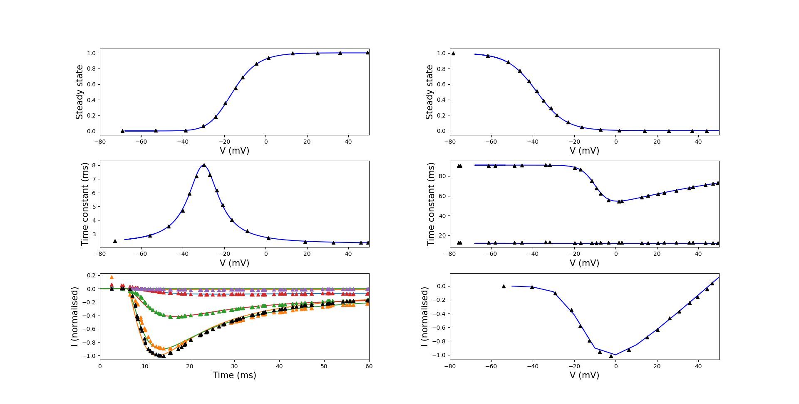
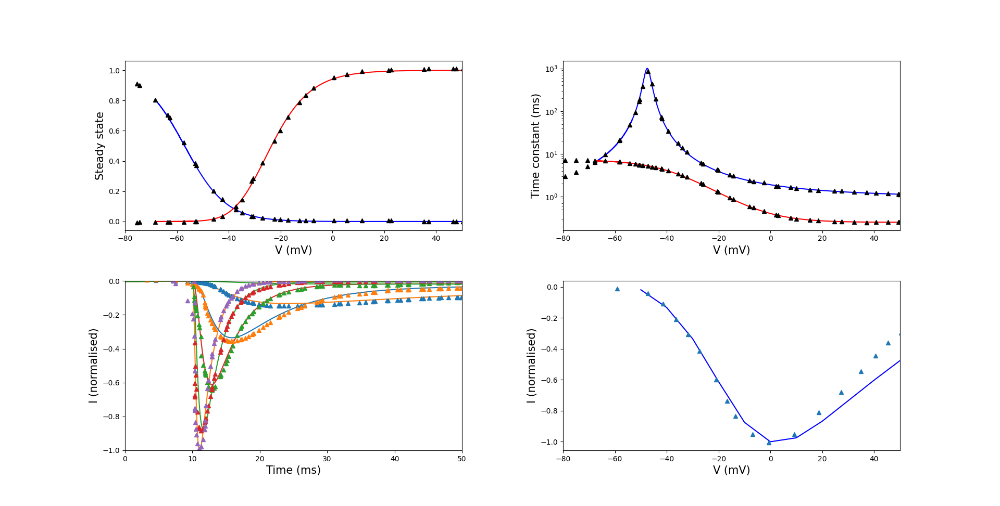

Original Paper
==============

:Original publication:  "A Computational Model of the Ionic Currents, Ca2+
Dynamics and Action Potentials Underlying Contraction
of Isolated Uterine Smooth Muscle"

:DOI: https://doi:10.1371/journal.pone.0018685

Model status
=============

The current CellML model implementation runs in OpenCOR_.
The CellML model parameters and equations must be updated regarding each specific simulations to reproduce the related results.
In some cases, the results have been validated against the data extracted from the figures in the published `: Tong W-C, et al (2011)`.
Using the default parameters provided in the paper, except figure 13.

Model Summary
==============
Uterine contractions during labor are discretely regulated by rhythmic action potentials (AP) of varying duration and forms
that determine calcium-dependent force production. The authors employed a computational biology approach to
develop a mathematical platform of biophysical detail to describe known uterine excitation-contraction coupling mechanisms.

.. image:: Schematic_diagram.png
   :width: 100%
   :alt: Schematic diagram.

Model Equations
===============
The model is implemented using a Hodgkin-Huxley type formulation. The cell membrane lipid bilayer is represented as a capacitance (Cm),
and the ion channels in the membrane are represented as conductance. The change in the transmembrane potential (Vm) over time depends on
is the sum of the individual ion currents through each class of ion channel in the cell current:

:math:` \frac{dVm}{dt} = - \frac{I_{tot}}{C_{m}}`.

Where there are 14 different ion channels.

Ionic Currents
================
The current model includes fourteen ionic currents of uterine smooth muscle cells:

:math:`I_{CaL}`: L type Ca2+ current,

:math:`I_{CaT}`: T type Ca2+ current,

:math:`I_{Na}`: Na+ current,

:math:`I_{h}`:a hyperpolarization-activated current,

:math:`I_{K}` :three voltage-gated K+ currents [ik1, ik2, ika],

:math:`I_{BKa} \& I_{BKab}`'`: two Ca2+ activated K+ current,

:math:`I_{Cl}`: Ca2+ activated Cl current,

:math:`I_{NSCa}`:non-specific cation current,

:math:`I_{NaCa}`: Na+-Ca2+ exchanger,

:math:`I_{NaK}`: Na+-K+ pump and background current.

:math:`I_{b}`: background current.

Model Experiments
=================
The current workspace contains three folders:  Documents, Experiments, and Simulations. In Documents, one can find the readme file and related information. The experiments file has 11 folders corresponding to each figure in the primary paper. In each folder are two python scripts, one related to the current experiment set up and arranged parameters and the other related to plotting the figure.
In the Simulations folder, there are the CellML and SedMl files.

Model Modifications
===================
In the case of reproducibility and reusability, there are a couple of issues with the model simulations. Which, We point them as below:
For figure 13, the stimulation protocol changes.
Appendix S2 (supplement) contains a C code which includes the different stimulation details to reproduce figures 12 and 13A-C.

Model Validations
=================
In some cases, the results have been validated against the data extracted from the figures in the published ``_.

Figure 1. Myometrial ICaL model. Properties of ICaL are derived from experimental data of myometrial longitudinal cells from late pregnant rat.

Figure 2. Myometrial INa model. Properties of INa are derived from experimental data of myometrial longitudinal cells from late
pregnant rats.

